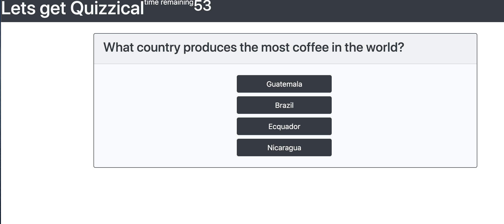

# code-quiz

## Description 
A quiz built with mixing Jquery, Js, Css and Html. Task is to start a quiz which starts a setInterval timer of 60 seconds. With each incorrect answer the timer will detract five seconds from the timer. After the quiz is completed the score will be saved if the player has beaten a high score. The quiz will then be prompted to be taken again.

## Usage 

## Credits 
Andres Long - Tutor for UT coding bootcamp

Bootstrap.com

